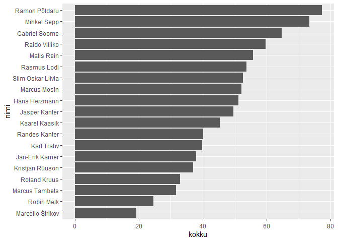

Jalgpalli 10-võistlus 2017
================
Hindrek Teder
2017-06-13

## Sissejuhatus

Helios 2005 grupi jalgpalli 10-võistlus toimus Piiri treeninglaagris.
Kokku osales 19 mängijat.

## Teegid

``` r
library(readxl)
library(janitor)
library(skimr)
library(tidyverse)
library(scales)
```

## Andmed

``` r
tulemused <- read_excel("jalgpalli 10-võistlus 2017.xlsx",
                        .name_repair = make_clean_names)
skim(tulemused)
```

|                                                  |           |
| :----------------------------------------------- | :-------- |
| Name                                             | tulemused |
| Number of rows                                   | 19        |
| Number of columns                                | 11        |
| \_\_\_\_\_\_\_\_\_\_\_\_\_\_\_\_\_\_\_\_\_\_\_   |           |
| Column type frequency:                           |           |
| character                                        | 1         |
| numeric                                          | 10        |
| \_\_\_\_\_\_\_\_\_\_\_\_\_\_\_\_\_\_\_\_\_\_\_\_ |           |
| Group variables                                  | None      |

Data summary

**Variable type: character**

| skim\_variable | n\_missing | complete\_rate | min | max | empty | n\_unique | whitespace |
| :------------- | ---------: | -------------: | --: | --: | ----: | --------: | ---------: |
| nimi           |          0 |              1 |  10 |  17 |     0 |        19 |          0 |

**Variable type: numeric**

| skim\_variable     | n\_missing | complete\_rate |  mean |    sd |    p0 |   p25 |   p50 |   p75 |  p100 | hist  |
| :----------------- | ---------: | -------------: | ----: | ----: | ----: | ----: | ----: | ----: | ----: | :---- |
| jalaga\_koksimine  |          0 |           1.00 | 16.89 | 20.58 |  2.00 |  6.50 | 11.00 | 15.00 | 92.00 | ▇▂▁▁▁ |
| kaugusloomine      |          0 |           1.00 |  9.74 |  5.29 |  1.00 |  5.50 | 10.00 | 14.00 | 18.00 | ▇▆▇▇▇ |
| tribling           |          2 |           0.89 | 21.20 |  3.60 | 17.90 | 19.28 | 19.67 | 20.90 | 28.30 | ▇▃▁▁▂ |
| peaga\_koksimine   |          0 |           1.00 |  4.89 |  3.11 |  2.00 |  3.00 |  4.00 |  5.00 | 16.00 | ▇▅▁▁▁ |
| audivise           |          0 |           1.00 | 10.00 |  5.63 |  1.00 |  5.50 | 10.00 | 14.50 | 19.00 | ▇▇▆▇▇ |
| korgusloomine      |          2 |           0.89 |  3.29 |  0.29 |  2.90 |  3.03 |  3.34 |  3.52 |  3.86 | ▇▅▆▃▅ |
| latti\_loomine     |          1 |           0.95 |  0.78 |  0.81 |  0.00 |  0.00 |  1.00 |  1.00 |  2.00 | ▇▁▆▁▃ |
| palliga\_jooksmine |          0 |           1.00 | 12.53 |  1.19 | 10.75 | 11.95 | 12.31 | 12.90 | 15.22 | ▅▇▇▁▂ |
| penalt             |          0 |           1.00 |  1.11 |  0.81 |  0.00 |  1.00 |  1.00 |  1.50 |  3.00 | ▃▇▁▃▁ |
| tapsusloomine      |          0 |           1.00 |  1.42 |  0.90 |  0.00 |  1.00 |  1.00 |  2.00 |  3.00 | ▃▇▁▇▂ |

## Punktiarvestus

Iga ala eest oli võimalik teenida 1 kuni 10 punkti vastavalt tulemusele.
Ala tegemata jätmise korral punkte ei antud. Seega oli 10 ala pealt
võimalik kokku teenida maksimaalselt 100 punkti (10 alavõitu).

``` r
punktid <- tulemused %>% 
  pivot_longer(-nimi, names_to = "ala", values_to = "tulemus") %>% 
  mutate(punktid = if_else(ala %in% c("tribling", "palliga_jooksmine"), -tulemus, tulemus)) %>% 
  group_by(ala) %>% 
  mutate(punktid = rescale(punktid, c(1, 10))) %>% 
  ungroup()
```

## Alavõitjad

``` r
punktid %>% 
  group_by(ala) %>% 
  filter(punktid == max(punktid, na.rm = T)) %>% 
  select(ala, tulemus, nimi) %>% 
  arrange(ala)
```

<div class="kable-table">

| ala                | tulemus | nimi              |
| :----------------- | ------: | :---------------- |
| audivise           |   19.00 | Raido Villiko     |
| jalaga\_koksimine  |   92.00 | Mihkel Sepp       |
| kaugusloomine      |   18.00 | Ramon Põldaru     |
| korgusloomine      |    3.86 | Ramon Põldaru     |
| latti\_loomine     |    2.00 | Kaarel Kaasik     |
| latti\_loomine     |    2.00 | Siim Oskar Liivla |
| latti\_loomine     |    2.00 | Gabriel Soome     |
| latti\_loomine     |    2.00 | Jan-Erik Kärner   |
| palliga\_jooksmine |   10.75 | Hans Herzmann     |
| peaga\_koksimine   |   16.00 | Ramon Põldaru     |
| penalt             |    3.00 | Ramon Põldaru     |
| tapsusloomine      |    3.00 | Randes Kanter     |
| tapsusloomine      |    3.00 | Jasper Kanter     |
| tribling           |   17.90 | Ramon Põldaru     |

</div>

## Kokkuvõte

``` r
kokku <- punktid %>% 
  group_by(nimi) %>% 
  summarise(kokku = sum(punktid, na.rm = T)) %>% 
  arrange(desc(kokku))
```

    ## `summarise()` ungrouping output (override with `.groups` argument)

``` r
kokku
```

<div class="kable-table">

| nimi              |    kokku |
| :---------------- | -------: |
| Ramon Põldaru     | 77.22617 |
| Mihkel Sepp       | 73.28312 |
| Gabriel Soome     | 64.77454 |
| Raido Villiko     | 59.68095 |
| Matis Rein        | 55.73407 |
| Rasmus Lodi       | 53.70576 |
| Siim Oskar Liivla | 52.56387 |
| Marcus Mosin      | 52.14349 |
| Hans Herzmann     | 51.13419 |
| Jasper Kanter     | 49.53458 |
| Kaarel Kaasik     | 45.28677 |
| Randes Kanter     | 40.23017 |
| Karl Trahv        | 39.81180 |
| Jan-Erik Kärner   | 38.02591 |
| Kristjan Rüüson   | 36.96399 |
| Roland Kruus      | 32.90344 |
| Marcus Tambets    | 31.61507 |
| Robin Melk        | 24.60885 |
| Marcello Širikov  | 19.28654 |

</div>

``` r
kokku %>% 
  ggplot(aes(x = kokku, y = reorder(nimi, kokku))) +
  geom_col() +
  labs(y = "nimi")
```

<!-- -->
