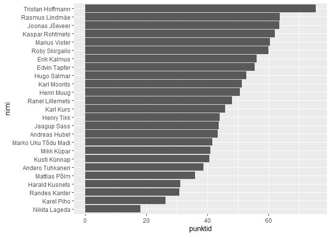

Jalgpalli 10-võistlus 2019
================
Hindrek Teder
2019-07-19

## Sissejuhatus

Helios U17 ja U15 gruppide jalgpalli 10-võistlus toimus Piiri
treeninglaagris. Kokku osales 25 mängijat.

## Teegid

``` r
library(readxl)
library(janitor)
library(skimr)
library(tidyverse)
library(scales)
```

## Andmed

``` r
tulemused <- read_excel("jalgpalli 10-võistlus 2019.xlsx",
                        .name_repair = make_clean_names)
skim(tulemused)
```

|                                                  |           |
| :----------------------------------------------- | :-------- |
| Name                                             | tulemused |
| Number of rows                                   | 25        |
| Number of columns                                | 11        |
| \_\_\_\_\_\_\_\_\_\_\_\_\_\_\_\_\_\_\_\_\_\_\_   |           |
| Column type frequency:                           |           |
| character                                        | 1         |
| numeric                                          | 10        |
| \_\_\_\_\_\_\_\_\_\_\_\_\_\_\_\_\_\_\_\_\_\_\_\_ |           |
| Group variables                                  | None      |

Data summary

**Variable type: character**

| skim\_variable | n\_missing | complete\_rate | min | max | empty | n\_unique | whitespace |
| :------------- | ---------: | -------------: | --: | --: | ----: | --------: | ---------: |
| nimi           |          0 |              1 |   9 |  19 |     0 |        25 |          0 |

**Variable type: numeric**

| skim\_variable     | n\_missing | complete\_rate |  mean |    sd |    p0 |   p25 |   p50 |   p75 |   p100 | hist  |
| :----------------- | ---------: | -------------: | ----: | ----: | ----: | ----: | ----: | ----: | -----: | :---- |
| jalaga\_koksimine  |          0 |           1.00 | 60.88 | 78.39 |  3.00 | 23.00 | 36.00 | 63.00 | 355.00 | ▇▂▁▁▁ |
| kaugusloomine      |          0 |           1.00 | 40.88 |  9.48 | 23.00 | 33.00 | 44.00 | 47.00 |  56.00 | ▃▃▂▇▅ |
| tribling           |          1 |           0.96 | 17.62 |  1.56 | 14.70 | 16.31 | 18.08 | 18.79 |  19.92 | ▃▃▂▇▅ |
| peaga\_koksimine   |          0 |           1.00 |  9.48 |  9.32 |  3.00 |  4.00 |  6.00 |  9.00 |  42.00 | ▇▂▁▁▁ |
| audivise           |          0 |           1.00 | 16.92 |  3.38 | 10.00 | 14.00 | 17.00 | 19.00 |  23.00 | ▂▇▇▆▆ |
| korgusloomine      |          0 |           1.00 |  3.91 |  0.35 |  3.13 |  3.66 |  3.91 |  4.18 |   4.52 | ▂▅▇▅▅ |
| latti\_loomine     |          0 |           1.00 |  0.84 |  0.80 |  0.00 |  0.00 |  1.00 |  1.00 |   2.00 | ▇▁▇▁▅ |
| palliga\_jooksmine |          0 |           1.00 | 11.53 |  0.65 | 10.35 | 11.14 | 11.40 | 11.93 |  12.92 | ▃▆▇▃▃ |
| penalt             |          0 |           1.00 |  0.60 |  0.91 |  0.00 |  0.00 |  0.00 |  1.00 |   3.00 | ▇▂▁▂▁ |
| tapsusloomine      |          0 |           1.00 |  2.92 |  1.12 |  0.00 |  2.00 |  3.00 |  4.00 |   5.00 | ▂▅▇▆▁ |

## Punktiarvestus

Iga ala eest oli võimalik teenida 1 kuni 10 punkti vastavalt tulemusele.
Ala tegemata jätmise korral punkte ei antud. Seega oli 10 ala pealt
võimalik kokku teenida maksimaalselt 100 punkti (10 alavõitu).

``` r
punktid <- tulemused %>% 
  pivot_longer(-nimi, names_to = "ala", values_to = "tulemus") %>% 
  mutate(punktid = if_else(ala %in% c("tribling", "palliga_jooksmine"), -tulemus, tulemus)) %>% 
  group_by(ala) %>% 
  mutate(punktid = rescale(punktid, c(1, 10))) %>% 
  ungroup()
```

## Alavõitjad

``` r
punktid %>% 
  group_by(ala) %>% 
  filter(punktid == max(punktid, na.rm = T)) %>% 
  select(ala, tulemus, nimi) %>% 
  arrange(ala)
```

<div class="kable-table">

| ala                | tulemus | nimi                |
| :----------------- | ------: | :------------------ |
| audivise           |   23.00 | Rasmus Lindmäe      |
| jalaga\_koksimine  |  355.00 | Tristan Hoffmann    |
| kaugusloomine      |   56.00 | Rasmus Lindmäe      |
| korgusloomine      |    4.52 | Erik Kalmus         |
| latti\_loomine     |    2.00 | Jaagup Sass         |
| latti\_loomine     |    2.00 | Joonas Jõeveer      |
| latti\_loomine     |    2.00 | Kaspar Rohtmets     |
| latti\_loomine     |    2.00 | Marko Uku Tõdu Madi |
| latti\_loomine     |    2.00 | Mattias Põlm        |
| latti\_loomine     |    2.00 | Ranel Lillemets     |
| palliga\_jooksmine |   10.35 | Henri Muug          |
| peaga\_koksimine   |   42.00 | Roby Skirgailo      |
| penalt             |    3.00 | Kaspar Rohtmets     |
| tapsusloomine      |    5.00 | Tristan Hoffmann    |
| tribling           |   14.70 | Edvin Tapfer        |

</div>

## Kokkuvõte

``` r
kokku <- punktid %>% 
  group_by(nimi) %>% 
  summarise(kokku = sum(punktid, na.rm = T)) %>% 
  arrange(desc(kokku))
```

    ## `summarise()` ungrouping output (override with `.groups` argument)

``` r
kokku
```

<div class="kable-table">

| nimi                |    kokku |
| :------------------ | -------: |
| Tristan Hoffmann    | 75.41653 |
| Rasmus Lindmäe      | 63.59489 |
| Joonas Jõeveer      | 63.49073 |
| Kaspar Rohtmets     | 61.98755 |
| Marius Vister       | 60.45677 |
| Roby Skirgailo      | 59.94477 |
| Erik Kalmus         | 56.06087 |
| Edvin Tapfer        | 55.43781 |
| Hugo Salmar         | 52.68720 |
| Karl Moorits        | 51.21335 |
| Henri Muug          | 50.66431 |
| Ranel Lillemets     | 47.99302 |
| Karl Kurs           | 45.68561 |
| Henry Tikk          | 43.91548 |
| Jaagup Sass         | 43.73654 |
| Andreas Hubel       | 43.36997 |
| Marko Uku Tõdu Madi | 41.58706 |
| Mikk Küpar          | 40.90893 |
| Kusti Künnap        | 40.53871 |
| Andero Tuhkanen     | 38.66009 |
| Mattias Põlm        | 35.93965 |
| Harald Kusnets      | 31.11229 |
| Randes Kanter       | 30.67890 |
| Karel Piho          | 26.23427 |
| Nikita Lageda       | 17.92832 |

</div>

``` r
kokku %>% 
  ggplot(aes(x = kokku, y = reorder(nimi, kokku))) +
  geom_col() +
  labs(y = "nimi")
```

<!-- -->
