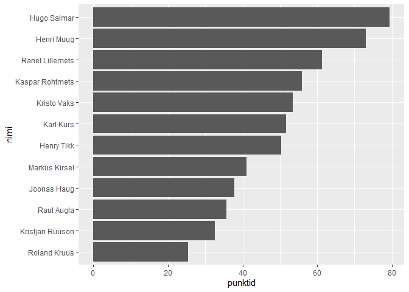

Jalgpalli 10-võistlus 2020
================
Hindrek Teder
2020-07-18

## Sissejuhatus

Helios U17 grupi jalgpalli 10-võistlus toimus Piiri treeninglaagris.
Kokku osales 12 mängijat.

## Teegid

``` r
library(readxl)
library(skimr)
library(tidyverse)
library(scales)
```

## Andmed

``` r
tulemused <- read_excel("jalgpalli 10-võistlus 2020.xlsx")
skim(tulemused)
```

|                                                  |           |
| :----------------------------------------------- | :-------- |
| Name                                             | tulemused |
| Number of rows                                   | 12        |
| Number of columns                                | 11        |
| \_\_\_\_\_\_\_\_\_\_\_\_\_\_\_\_\_\_\_\_\_\_\_   |           |
| Column type frequency:                           |           |
| character                                        | 1         |
| numeric                                          | 10        |
| \_\_\_\_\_\_\_\_\_\_\_\_\_\_\_\_\_\_\_\_\_\_\_\_ |           |
| Group variables                                  | None      |

Data summary

**Variable type: character**

| skim\_variable | n\_missing | complete\_rate | min | max | empty | n\_unique | whitespace |
| :------------- | ---------: | -------------: | --: | --: | ----: | --------: | ---------: |
| nimi           |          0 |              1 |   9 |  15 |     0 |        12 |          0 |

**Variable type: numeric**

| skim\_variable    | n\_missing | complete\_rate |  mean |    sd |    p0 |   p25 |   p50 |   p75 |   p100 | hist  |
| :---------------- | ---------: | -------------: | ----: | ----: | ----: | ----: | ----: | ----: | -----: | :---- |
| jalaga kõksimine  |          0 |              1 | 39.08 | 51.88 |  3.00 |  6.25 | 17.50 | 45.25 | 164.00 | ▇▁▁▁▁ |
| kauguslöömine     |          0 |              1 |  6.25 |  3.28 |  1.00 |  3.75 |  6.50 |  9.00 |  11.00 | ▇▅▅▇▅ |
| tribling          |          0 |              1 | 14.53 |  1.16 | 12.79 | 13.66 | 14.62 | 15.19 |  16.14 | ▇▂▇▅▇ |
| peaga kõksimine   |          0 |              1 |  7.17 |  6.29 |  3.00 |  3.75 |  4.50 |  8.00 |  25.00 | ▇▂▁▁▁ |
| audivise          |          0 |              1 |  5.67 |  3.37 |  1.00 |  2.75 |  5.50 |  8.25 |  11.00 | ▇▃▃▃▃ |
| kõrguslöömine     |          0 |              1 |  4.06 |  0.25 |  3.56 |  3.83 |  4.18 |  4.26 |   4.27 | ▁▃▁▁▇ |
| latti löömine     |          0 |              1 |  0.25 |  0.45 |  0.00 |  0.00 |  0.00 |  0.25 |   1.00 | ▇▁▁▁▂ |
| palliga jooksmine |          0 |              1 | 12.98 |  1.06 | 11.83 | 12.16 | 12.53 | 13.97 |  14.75 | ▇▃▂▂▅ |
| penalt            |          0 |              1 |  1.42 |  1.08 |  0.00 |  0.75 |  1.50 |  2.00 |   3.00 | ▆▆▁▇▃ |
| täpsuslöömine     |          0 |              1 |  2.00 |  1.04 |  0.00 |  1.75 |  2.00 |  2.25 |   4.00 | ▁▂▇▂▁ |

## Punktiarvestus

Iga ala eest oli võimalik teenida 1 kuni 10 punkti vastavalt tulemusele.
Ala tegemata jätmise korral punkte ei antud. Seega oli 10 ala pealt
võimalik kokku teenida maksimaalselt 100 punkti (10 alavõitu).

``` r
punktid <- tulemused %>% 
  pivot_longer(-nimi, names_to = "ala", values_to = "tulemus") %>% 
  mutate(punktid = if_else(ala %in% c("tribling", "palliga jooksmine"), -tulemus, tulemus)) %>% 
  group_by(ala) %>% 
  mutate(punktid = rescale(punktid, c(1, 10))) %>% 
  ungroup()
```

## Alavõitjad

``` r
punktid %>% 
  group_by(ala) %>% 
  filter(punktid == max(punktid, na.rm = T)) %>% 
  select(ala, nimi, tulemus) %>% 
  arrange(ala)
```

<div class="kable-table">

| ala               | nimi            | tulemus |
| :---------------- | :-------------- | ------: |
| audivise          | Karl Kurs       |  11.000 |
| jalaga kõksimine  | Hugo Salmar     | 164.000 |
| kauguslöömine     | Henry Tikk      |  11.000 |
| kõrguslöömine     | Henri Muug      |   4.266 |
| latti löömine     | Kaspar Rohtmets |   1.000 |
| latti löömine     | Kristjan Rüüson |   1.000 |
| latti löömine     | Ranel Lillemets |   1.000 |
| palliga jooksmine | Henri Muug      |  11.832 |
| peaga kõksimine   | Henri Muug      |  25.000 |
| penalt            | Henry Tikk      |   3.000 |
| penalt            | Hugo Salmar     |   3.000 |
| tribling          | Henri Muug      |  12.792 |
| täpsuslöömine     | Hugo Salmar     |   4.000 |

</div>

## Kokkuvõte

``` r
kokku <- punktid %>% 
  group_by(nimi) %>% 
  summarise(punktid = sum(punktid, na.rm = T)) %>% 
  arrange(desc(punktid)) %>% 
  rowid_to_column(var = "koht")
```

    ## `summarise()` ungrouping output (override with `.groups` argument)

``` r
kokku
```

<div class="kable-table">

| koht | nimi            |  punktid |
| ---: | :-------------- | -------: |
|    1 | Hugo Salmar     | 79.37494 |
|    2 | Henri Muug      | 73.08851 |
|    3 | Ranel Lillemets | 61.29353 |
|    4 | Kaspar Rohtmets | 55.83771 |
|    5 | Kristo Vaks     | 53.50956 |
|    6 | Karl Kurs       | 51.69425 |
|    7 | Henry Tikk      | 50.36067 |
|    8 | Markus Kirsel   | 41.01890 |
|    9 | Joonas Haug     | 37.75335 |
|   10 | Raul Augla      | 35.71357 |
|   11 | Kristjan Rüüson | 32.56337 |
|   12 | Roland Kruus    | 25.33693 |

</div>

``` r
kokku %>% 
  ggplot(aes(x = punktid, y = reorder(nimi, punktid))) +
  geom_col() +
  labs(y = "nimi")
```

<!-- -->
